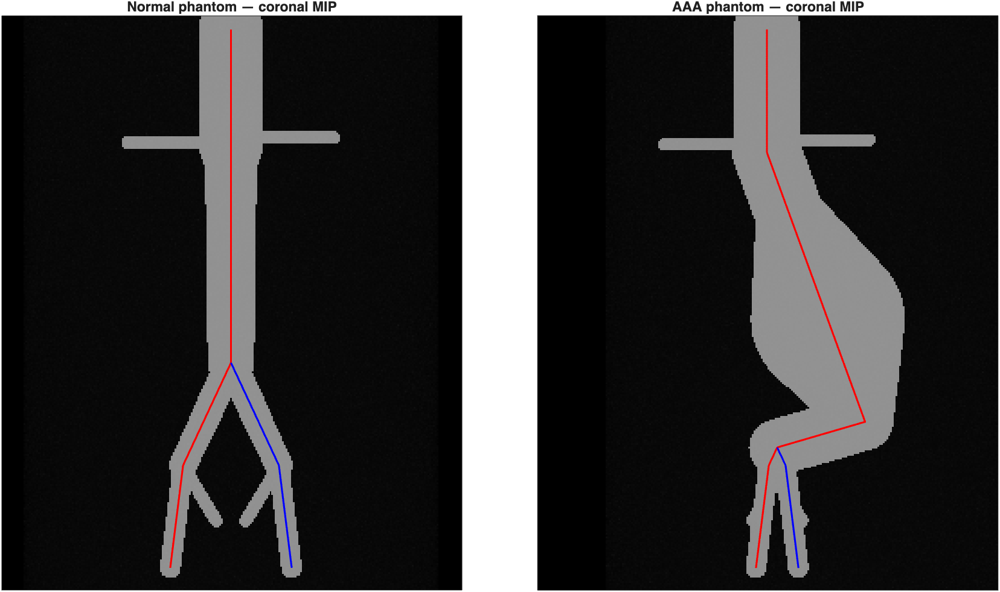

# Aortic Segmenter and EVAR Planner

**Open-source, automated planning for endovascular aneurysm repair (EVAR), starting from a raw CT angiogram and written in MATLAB.**

[](https://github.com/davidstonko/aortic-segmenter-and-surgery-planner/actions/workflows/matlab-smoke.yml)
[](LICENSE)
[](SETUP.md)

Project page: <https://localminimum.us/research/evar-planner/>

> **Research use only.** This software is for academic and methods-development
> work. It is **not a medical device**, it has **not been clinically validated**,
> and its output must **not be used for clinical decisions**.



*The two bundled synthetic phantoms (normal and AAA) with their bifurcated
centerlines. These are procedurally generated. No patient images ship with this
repository.*

---

## What it does

Given an arterial-phase CT angiogram, the pipeline runs these steps with no clicks:

- **DICOM ingest.** Reads a CT series into a uniform volume struct.
- **Segmentation.** [TotalSegmentator](https://github.com/wasserth/TotalSegmentator)
  segments the aorta, iliac arteries, kidneys and liver. The segmentation
  backend can be swapped (see [Segmentation backends](#segmentation-backends)).
- **Branch detection and repair.** Finds the renal arteries, celiac trunk and
  SMA. It extends the iliacs into the common femoral arteries (CFAs) and repairs
  gaps in vessel connectivity using HU values. By default the CFA extension
  stops about 3 cm below the inguinal ligament, at mid-CFA
  (`opts.cap_cfa_at_inguinal`, `opts.cfa_distal_margin_mm = 30`).
- **Anatomic auto-seeds.** Places the proximal seed in the supraceliac aorta and
  the distal seeds in the right and left CFAs.
- **Bifurcated centerline.** VMTK's Voronoi / fast-marching centerline is the
  preferred method. A pure-MATLAB skeleton-graph shortest path is used when VMTK
  is not installed (`opts.centerline_backend` = `auto` | `vmtk` | `matlab`).
- **EVAR measurements:**
  - proximal neck diameter, length and angulation (α and β; β is the value
    checked against the IFU)
  - neck length measured from the **lowest renal artery ostium**, checked for
    plausibility against the kidneys
  - the **aortic bifurcation**, located from the iliac labels
  - iliac diameters and take-off angle, and the peak aneurysm diameter

  Iliac seal length is reported as **not assessed**.
- **IFU device matching.** Checks the measurements against the instructions-for-use
  (IFU) criteria of 7 stent grafts: Gore Excluder, Gore Excluder Conformable,
  Medtronic Endurant II, Cook Zenith Flex, Endologix AFX2, Endologix Ovation iX
  and Terumo Treo. The device criteria were checked against manufacturer and FDA
  labeling on 2026-09-29; the document numbers are cited in `+ifu/devices.m`.
  **No device is recommended when quality control (QC) fails.**
- **Structured plan.** Writes the plan as `.txt` and `.json`, with the reasoning
  behind it and a QC verdict.

Other components:

- **GUI.** `AorticCenterlineApp` walks through 6 steps: Load CT → Segment →
  Endpoints → Centerline → Analyze → Export. Each step can run automatically or
  be driven by the user.
- **Headless and batch runners.** `run_planner_headless` runs one case and
  `scripts/run_batch.m` runs a folder of cases.
- **De-identification intake** (`+intake`). Copies a study, scrubs it, verifies
  the scrub and records it in a manifest. A study that fails verification is
  quarantined.
- **Annotation SOP and learned-segmentation roadmap** (see
  [docs/](docs/)). These support the next phase, which trains a segmentation
  model.

## Status and known limitations

Please read this section before using the results.

- **Scope.** The planner works end-to-end on **arterial-phase, aorta-protocol CTA**.
  Non-arterial scans, such as routine chest/abdomen/pelvis CT, are out of scope.
- **Current results on the author's local test set** (7 unique scans, current code):
  - 2 scans produced a usable plan.
  - 2 scans ran to completion and were **correctly flagged unusable** by the
    built-in QC.
  - 3 scans **failed at automatic seeding** because TotalSegmentator missed one
    iliac artery.

  No case silently produced a bad plan. Making the planner work on new scans is
  the main open problem. A learned-segmentation phase is in progress
  ([docs/LEARNED_SEGMENTATION_ROADMAP.md](docs/LEARNED_SEGMENTATION_ROADMAP.md)).
- **All diameters are contrast-lumen diameters.** They exclude mural thrombus, so
  they **under-call the outer-wall aneurysm diameter**. They also under-call
  against IFU ranges, which are defined outer wall to outer wall.
- **No reference validation yet.** The measurements have **not** been validated
  against a reference workstation. A TeraRecon benchmark is planned; the files
  `library/reference/*.ref.json` are empty templates.
- **Research use only.** This is not a medical device and must not be used for
  clinical decisions.

## Requirements

- **MATLAB R2024a or newer.** CI tests R2024a and R2024b, and development is on
  R2025b.
- **Image Processing Toolbox** (required).
- **Optional external tools:**

  | Tool | Used for | Environment |
  |------|----------|-------------|
  | [TotalSegmentator](https://github.com/wasserth/TotalSegmentator) | automatic segmentation (default backend) | `environment.yml` (`evar-tools`) |
  | [VMTK](http://www.vmtk.org) | Voronoi / fast-marching centerlines (preferred) | `environment-vmtk.yml` (`vmtk`) |
  | [nnU-Net v2](https://github.com/MIC-DKFZ/nnUNet) | the `learned` segmentation backend (needs trained weights) | see [DEPENDENCIES.md](DEPENDENCIES.md) |

  Without TotalSegmentator, automatic planning from raw DICOM is not available.
  You can still use the GUI's manual segmentation tools or supply your own mask
  with the `external` backend. Without VMTK, the MATLAB skeleton centerline is
  used instead.

## Installation

```bash
git clone https://github.com/davidstonko/aortic-segmenter-and-surgery-planner.git
cd aortic-segmenter-and-surgery-planner

# Optional external tools (see SETUP.md for Apple Silicon notes)
conda env create -f environment.yml        # TotalSegmentator  -> env "evar-tools"
conda env create -f environment-vmtk.yml   # VMTK              -> env "vmtk"
```

Then in MATLAB, from the repository root:

```matlab
setup.check_dependencies   % prints which tools and toolboxes were found
```

Full step-by-step instructions are in [SETUP.md](SETUP.md), and external-tool
details are in [DEPENDENCIES.md](DEPENDENCIES.md).

## Quick start: bundled synthetic phantom

This example needs only MATLAB and the Image Processing Toolbox; no external
tools or patient data are required. It auto-seeds the AAA phantom, builds the
bifurcated skeleton centerline, and generates an EVAR plan:

```matlab
addpath(pwd);                                    % from the repo root
P = load(fullfile('library', 'PHANTOM_aaa_male.mat'));
D = struct('pixel_mm', P.pixel_mm, 'slice_spacing_mm', P.slice_spacing_mm, ...
           'is_volume', P.is_volume);

seeds = preprocess.auto_seeds_from_mask(P.mask, D);
S = preprocess.build_skeleton_graph(P.mask, struct('min_branch_length', 10, ...
        'min_radius_vox', 0, 'radius_weight_pow', 2));
[PvR, RR] = preprocess.centerline_seeds(S, [seeds.proximal; seeds.right_cfa]);
[PvL, RL] = preprocess.centerline_seeds(S, [seeds.proximal; seeds.left_cfa]);

[r.Pv_mm_right, r.R_mm_right] = preprocess.centerline_to_mm(PvR, RR, D);
[r.Pv_mm_left,  r.R_mm_left ] = preprocess.centerline_to_mm(PvL, RL, D);
r.seeds = seeds;

plan = evar_plan.generate_plan(r);   % prints measurements + IFU ranking
```

To try the GUI without data, run `run_app`, then choose Step 1 →
**Open phantom from library…** and pick a `_raw` phantom.

| File in `library/` | Contents |
|--------------------|----------|
| `PHANTOM_normal_male.mat`, `PHANTOM_aaa_male.mat` | answer key: mask, paired centerlines, seeds, landmarks |
| `PHANTOM_normal_male_raw.mat`, `PHANTOM_aaa_male_raw.mat` | synthetic CT only, for working a case from scratch |

`scripts/regenerate_phantoms.m` rebuilds all four files.

## Usage

### Headless (one case, zero clicks)

```matlab
out  = run_planner_headless('/path/to/DICOM-series');
plan = out.plan;          % measurements, ranked devices, QC verdict
out.qc.usable             % false => do not trust the numbers
```

Commonly used options (fields of a struct passed as the second argument):

| Option | Values | Meaning |
|--------|--------|---------|
| `centerline_backend` | `auto` (default), `vmtk`, `matlab` | which centerline method to use |
| `seg_backend` | `totalsegmentator` (default), `learned`, `external`, `auto` | which segmentation to use |
| `ts_mode` | `fast` (default), `full` | TotalSegmentator 3 mm model, or the 1.5 mm model |
| `out_dir` | path | where outputs are written |

### GUI

```matlab
run_app          % or: app.AorticCenterlineApp
```

### Batch (a folder of cases)

```matlab
addpath('scripts');
results = run_batch('/path/to/cohort-root');   % one sub-folder per case
```

This writes one summary CSV row per case, including status, audit and QC
results, key measurements and eligible devices.

### Segmentation backends

`opts.seg_backend` controls where the segmentation comes from:

- **`totalsegmentator`** (default). Uses TotalSegmentator plus the
  branch-detection, CFA-extension and connectivity-repair steps above.
- **`learned`**. Uses an nnU-Net model (`+autoseg/+aortaseg24/`). No public
  weights exist yet, so this backend stops with a clear error until
  `AORTASEG24_MODEL_DIR` points at a trained checkpoint.
- **`external`**. Plans from **any** label NIfTI on the CT grid, such as a
  hand-annotated mask or another model's output:

  ```matlab
  out = run_planner_headless('/path/to/DICOM-series', struct( ...
      'seg_backend',     'external', ...
      'seg_label_nifti', '/path/to/labels.nii.gz', ...
      'seg_class_map',   'data/setA_class_map.json'));  % '' if already in pipeline labels
  ```

## Outputs

By default, headless runs write to `results/logs/headless_<timestamp>/`. This
folder is git-ignored because it can contain DICOM header data. Files written:

- `planner_result.mat`: seeds, mask, centerlines, radius profiles, QC and timing
- `plan.txt` and `plan.json`: measurements, ranked devices, recommendation or
  "no device", QC verdict and disclaimer
- `planner_qc.png`: a QC figure (MIPs with the centerline overlaid)

GUI Step 6 exports `centerline.mat`, the plan, and a lumen surface mesh (STL,
written by `evar_plan.export_mesh`).

## Validation and datasets

- [docs/datasets.md](docs/datasets.md) lists the public reference cohorts and
  how they are used. For example, the AAA-100 cohort (Zenodo 10932957) was used
  to calibrate the SE(3) centerline-plausibility thresholds.
- [docs/BENCHMARK_OPERATOR_STEPS.md](docs/BENCHMARK_OPERATOR_STEPS.md) and
  [docs/TERARECON_ANNOTATION_GUIDE.md](docs/TERARECON_ANNOTATION_GUIDE.md)
  describe the planned workstation benchmark (`scripts/run_benchmark.m`).
- [docs/SEGMENTATION_ANNOTATION_SOP.md](docs/SEGMENTATION_ANNOTATION_SOP.md)
  is the annotation protocol for the learned-segmentation training set.

## Roadmap

The next phase replaces the rule-based segmentation with a learned model trained
on de-identified, hand-annotated CTAs, so that the planner works on scans beyond
the development cases. See
[docs/LEARNED_SEGMENTATION_ROADMAP.md](docs/LEARNED_SEGMENTATION_ROADMAP.md).
A thoracic (TEVAR) extension is scoped in
[docs/TEVAR_REVIEW.md](docs/TEVAR_REVIEW.md).

## Repository layout

```
+app/               AorticCenterlineApp: the 6-step GUI
+autoseg/           segmentation: TotalSegmentator wrapper, backend selector, branch
                    detection, CFA extension, connectivity repair, audit, QC
  +aortaseg24/      learned (nnU-Net) segmentation backend
+evar_plan/         measurements, plan generation, reference comparison, mesh export
+ifu/               stent-graft IFU catalog, eligibility checks, device ranking
+intake/            DICOM de-identification intake, manifest, annotation checks
+io/                NIfTI and VTP read/write helpers
+library/           local case archive; AAA-100 and AortaSeg24 dataset loaders
+phantom/           synthetic CT phantom builders and loader
+preprocess/        DICOM load, auto-seeds, skeleton centerline, reformatting
+reference/         schema, loader and template for reference-measurement JSONs
+setup/             dependency check and install help
+ui_helpers/        GUI help text and widgets
+vmtk_centerline/   VMTK command-line wrapper
data/               non-PHI label maps (class maps, Slicer color table)
docs/               datasets, annotation SOP, roadmap, benchmark guides
  archive/          historical development notes (kept for provenance)
library/            synthetic phantoms and reference templates (patient cases are git-ignored)
scripts/            test runner, batch and benchmark runners, render/diagnostic tools
tests/              matlab.unittest regression suite
run_planner_headless.m   end-to-end DICOM -> centerline -> plan
run_app.m                GUI launcher
```

## Testing

```matlab
addpath('scripts');
rc = run_tests();   % runs everything under tests/; rc == 0 means all passed
```

Tests that depend on external tools or private case data are skipped
automatically when those are missing. GUI tests need a display. CI
(`.github/workflows/matlab-smoke.yml`) runs a smoke test and the regression suite
on MATLAB R2024a and R2024b for every push.

## Contributing and data privacy

Contributions are welcome; see [CONTRIBUTING.md](CONTRIBUTING.md).
**No protected health information (PHI) is ever committed.** Patient DICOM files,
cached volumes, results and renders from real scans are git-ignored. Every
`.mat` file except the synthetic phantoms is blocked by `.gitignore`. Real
studies enter the project only through the `+intake` de-identification gate,
under pseudonymous codenames.

## Citation

If you use this software, please cite it using [CITATION.cff](CITATION.cff)
(GitHub's "Cite this repository" button reads this file). Please also cite the
tools it builds on:

- **TotalSegmentator:** Wasserthal J, et al. *Radiology: Artificial Intelligence*
  2023;5(5):e230024.
- **VMTK:** Antiga L, et al. *Medical & Biological Engineering & Computing*
  2008;46(11):1097–1112.

## License and acknowledgements

[MIT](LICENSE) © 2026 David P. Stonko.

The MIT license covers **this repository's source code only**. This project
builds on [TotalSegmentator](https://github.com/wasserth/TotalSegmentator) and
[VMTK](http://www.vmtk.org), which have their own licenses. The third-party
reference datasets (AAA-100, AortaSeg24) are licensed **CC BY-NC**
(non-commercial). They are **not redistributed here**; download them from their
original sources under their own terms (see [docs/datasets.md](docs/datasets.md)).
